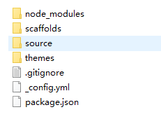
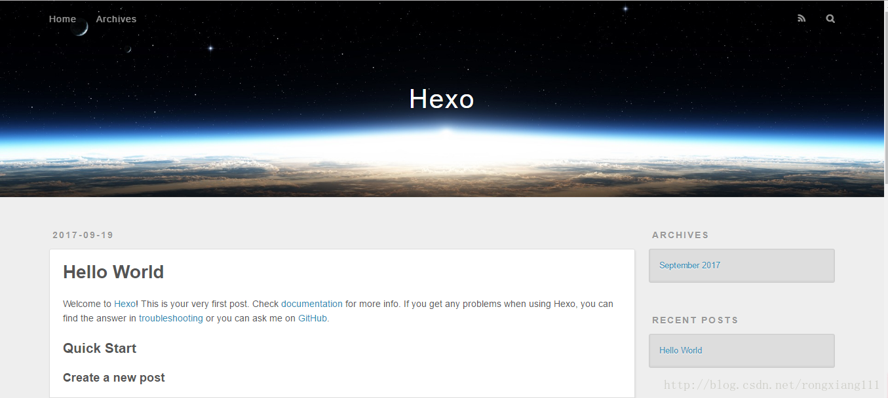
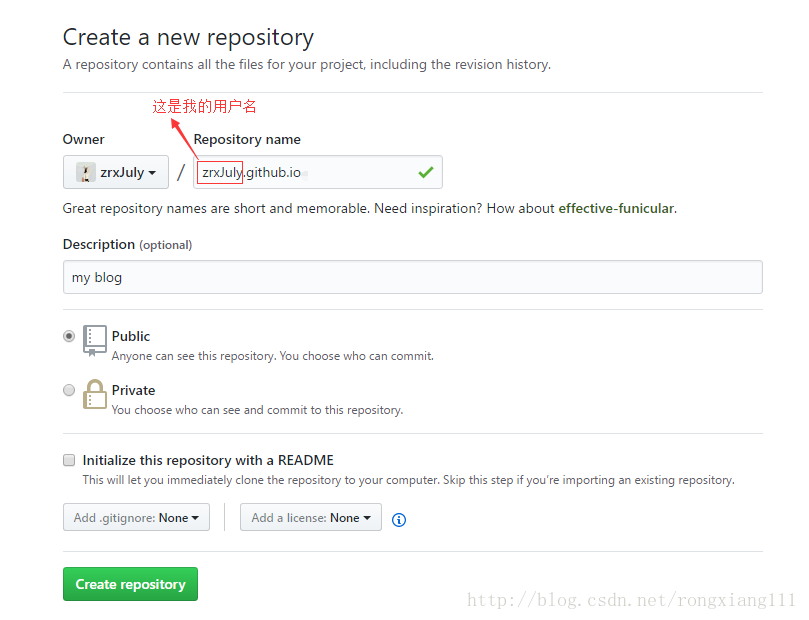
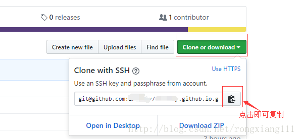

&emsp;&emsp;之前最开始是了解并搭建的jekyll框架，然后又从网上百度了一下，很多博客都支持Hexo，觉得Hexo更好用一些，也有很多支持jekyll的，自己确实不知道是jekyll和Hexo哪个更好用一些，所以又搭建了一下Hexo的环境。
我在这里对我自己的操作步骤进行总结了一下，教程也可以参考[Hexo官方文档](https://hexo.io/docs/)，写的比较详细。
## 什么是Hexo？
&emsp;&emsp;简单来说， [Hexo](https://hexo.io/)是一款快速、简易、强大的基于Node.js的静态博客框架，支持Markdown语法。在安装Hexo之前，必须得安装Node.js。  

下面就介绍一下搭建的步骤。当然，在此之前，您已经申请了GitHub账号以及本地已经安装了Git。
<!-- more -->
## 安装Node.js
node.js的安装过程可以参考[菜鸟教程](http://www.runoob.com/nodejs/nodejs-install-setup.html)，步骤很详细。
安装完成之后，可以测试一下是否安装成功：打开cmd，输入

```cmd
node -v
```
出现版本信息则证明安装成功。
## 安装Hexo
Node安装完成后，就开始安装Hexo。
在cmd命令行下，输入

```cmd
npm install -g hexo-cli
```
回车，安装可能会有些慢，请耐心等待。安装成功后，输入

```cmd
hexo version
```
回车，出现版本信息则安装成功。
## 创建一个博客
新建一个文件夹myblog（作为博客项目的名字，可以随便起），我这里建在了E盘。cmd命令进入刚才新建的文件夹下，输入

```cmd
hexo init //初始化博客项目
```
回车，初始化过程中也请耐心等待。
初始化完成后，输入

```cmd
npm install
```
回车，myblog文件夹下会生成如下目录：


```cmd
hexo generate //生成静态文件,也可输入 hexo g
```
完成后，输入：

```cmd
hexo server //启动本地服务，也可输入 hexo s
```
默认本地服务的网址为http://localhost:4000/ ，打开浏览器输入网址，如果看到博客首页，则成功。


感觉超级超级炫酷！

-----------------------------
## 上传至GitHub

 1. 登录进入到您自己的[GitHub网站](https://github.com/)首页，新建一个版本库（New Repository）
 
 
版本库的名字需是username.github.io的格式，比如我的用户名是zrxJuly,所以我的版本库名称为zrxJuly.github.io。Description是描述您的版本库的信息的，也可以不写。之后直接点击Create repository就OK了，这样，GitHub上的版本库就创建完成。当时我做的时候，在Setting中还设置了githubpages，一直报错，css样式显示不出来，所以先不要在setting中选择主题了。远程库创建告一段落。
 2. 下面回到您自己的本地myblog文件夹下，用编辑器打开名为_config.yml的文件，找到deploy配置项，将内容改为：

```yml
deploy:
  type: git #注意 : 后边一定要加空格，下同。 
  repository: git@github.com:username/username.github.io.git
  branch: master #分支名称
```
代码块第三行repository的地址来源：您刚创建远程库的地址

修改完成后，再修改一个地方，还是在_config.yml文件下，找到URL部分，将url和root如下设置：

```yml
url: https://username.github.io 
root: /
```
url修改也可参考[Hexo的中文文档](https://hexo.io/zh-cn/docs/configuration.html)
保存文件并关闭。
3. 本地myblog文件夹下，在这里打开GitBash（右键---->GitBash Here）,输入以下命令回车：
 

```cmd
npm install hexo-deployer-git --save #不执行此命令无法deploy到远程。
```
运行完后，输入：

```cmd
hexo g //重新生成静态文件
```
回车。基础步骤完成后，将本地创建的博客deploy到远程,发布到GitHub上：

```cmd
hexo d #也可写为hexo deploy
```
完成后，浏览器中输入您刚才设置的url：`https://username.github.io` 若和本地打开页面一样则成功。
&emsp;&emsp;对于大神来说，很快地就会搭完，so easy的。我想说，搭个博客好心酸，不过这样自己一总结感觉好简单，但是中间就是爱出很多问题，比如deploy到远程的时候，本地是没有一点问题的，但是远程css样式就是加载不出来，网上找了很多方法，试了之后，最后终于好了。

