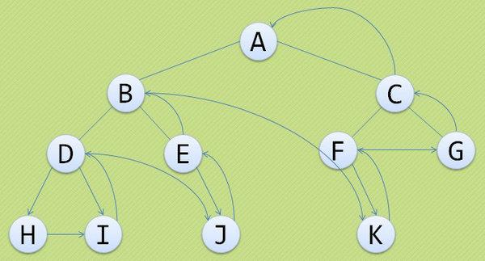

 
> 从今天开始刷LeetCode，目标：每周至少刷一个Coding Question，出一篇data structure学习博文进行总结。Fighting！
解出的代码案例也都会在我的[GitHub](https://github.com/zrxJuly)上进行维护。如果觉得对您有帮助，欢迎star or fork~
附上GitHub项目地址：[https://github.com/zrxJuly/dataStructure](https://github.com/zrxJuly/dataStructure)。
本文首发于我的个人博客：[zrxJuly's Blog](https://zrxjuly.github.io/)，欢迎访问，Let’s study together.

## 数组简介
&emsp;&emsp;数组是数据结构中的基本模块之一，因为字符串是由字符数组形成的，所以二者是相似的。
数组是一种基本的数据结构，用于按顺序存储元素集合，数组中的每个元素都可以通过数组索引来识别，元素可以随机存取。数组可以有一个或多个维度，
&emsp;&emsp; **一维数组**：也叫线性数组。数组具有固定的容量，我们需要在初始化时指定数组的大小。然而这种在初始化时指定数组大小的方法会很不方便甚至可能会造成浪费。

<!-- more -->

### Array Demo学习
```java
package com.zrxjuly.ds.arrayandstring.study;

import java.util.Arrays;
/**
 * @Description 数组的基本用法.
 */
public class Array {
    public static void arrayTest() {
        // 1. Initialize.初始化数组.
        int[] a0 = new int[5];
        int[] a1 = { 1, 2, 3 };
        // 2. Get Length.输出数组长度.
        System.out.println("The size of a1 is: " + a1.length);
        // 3. Access Element.访问数组元素.
        System.out.println("The first element is: " + a1[0]);
        // 4. Iterate all Elements.遍历所有元素，两个for循环，两种遍历方法.
        System.out.print("[Version 1] The contents of a1 are:");
        for (int i = 0; i < a1.length; ++i) {
            System.out.print(" " + a1[i]);
        }
        System.out.println();
        System.out.print("[Version 2] The contents of a1 are:");
        for (int item : a1) {
            System.out.print(" " + item);
        }
        System.out.println();
        // 5. Modify Element.修改指定下标的数组元素.
        a1[0] = 4;
        // 6. Sort.对数组进行排序.
        Arrays.sort(a1);
    }

    public static void main(String[] args) {
        arrayTest();
    }
}
```

## 动态数组简介
**动态数组**：是大小可变的随机存取的列表数据结构。大多数编程语言都会提供内置的动态数组。eg：在C++中的vector，Java中的ArrayList。
### Dynamic Array Demo 学习
```java
package com.zrxjuly.ds.arrayandstring.study;

import java.util.ArrayList;
import java.util.Arrays;
import java.util.Collections;
import java.util.List;

/**
 * @Description 动态数组
 *   大小可变的随机存取的列表数据结构.
 */
public class DynamicArray {
    public static void dynamicArray() {
        // 1. 集合初始化.
        List<Integer> v0 = new ArrayList<>();
        List<Integer> v1;
        // 声明并赋值数组.
        Integer[] a = {0, 1, 2, 3, 4};
        // Arrays.asList()方法：将数组转化为List，该方法将数组与列表链接起来，当更新其中一个时，另一个也会更新.
        v1 = new ArrayList<>(Arrays.asList(a));
        // 3. 将v1数组赋值给v2
        List<Integer> v2 = v1;                      // another reference to v1
        List<Integer> v3 = new ArrayList<>(v1);     // make an actual copy of v1
        // 3. get length
        System.out.println("The size of v1 is: " + v1.size());;
        // 4. access element
        System.out.println("The first element in v1 is: " + v1.get(0));
        // 5. iterate the vector.下面两种方法遍历集合内容.
        System.out.print("[Version 1] The contents of v1 are:");
        for (int i = 0; i < v1.size(); i ++) {
            System.out.print(" " + v1.get(i));
        }
        System.out.println();
        System.out.print("[Version 2] The contents of v1 are:");
        for (int item : v1) {
            System.out.print(" " + item);
        }
        
        System.out.println();
        // 6. modify element.修改元素，注意：v1使用Arrays.asList()方法赋值，因此v2中的元素修改后，v1也会修改
        v2.set(0, 5);       // modify v2 will actually modify v1
        System.out.println("The first element in v1 is: " + v1.get(0));
        v3.set(0, -1);
        System.out.println("The first element in v1 is: " + v1.get(0));
        // 7. sort. 对集合进行排序
        Collections.sort(v1);
        // 8. add new element at the end of the vector
        v1.add(-1);
        System.out.print("[Version 2] The contents of v1 are:");
        for (int item : v1) {
            System.out.print(" " + item);
        }
        System.out.println();
        v1.add(1, 6);
        System.out.print("[Version 2] The contents of v1 are:");
        for (int item : v1) {
            System.out.print(" " + item);
        }
        System.out.println();
        // 9. delete the last element
        v1.remove(v1.size() - 1);
        System.out.print("[Version 2] The contents of v1 are:");
        for (int item : v1) {
            System.out.print(" " + item);
        }
    }
    
    public static void main(String[] args) {
        dynamicArray();
    }
}
```

## Coding Question:寻找数组的中心索引
该Coding Question是LeetCode上数组模块的第一个编程问题。这里展示了两种解题思路及方法：
***思路一***
目标索引的左侧的数的总和 = 目标索引的右侧的数的总和。
***思路二***
左侧及索引对应的数 的总和+索引对应的数 = 总和-左侧及索引对应的数的总和+索引对应的数。

**详细分析请看代码及注释，或访问：[https://github.com/zrxJuly/dataStructure](https://github.com/zrxJuly/dataStructure)**

```java
package com.zrxjuly.ds.arrayandstring.demo;

/**
 * 
 * @author: zrxJuly
 * @Date: 2018-8-21 17:00:55
 * @Desription: Find Pivot Index. 寻找数组的中心索引。
 *   Coding Question:
 *       Given an array of integers nums, write a method that returns the "pivot" index of this array.
 *       We define the pivot index as the index where the sum of the numbers to the left of the index 
 *       is equal to the sum of the numbers to the right of the index.
 *       If no such index exists, we should return -1. 
 *       If there are multiple pivot indexes, you should return the left-most pivot index.
 *   |-题目：寻找数组的中心索引。
 *       给定一个整数类型的数组，编写一个返回数组中心索引的方法。
 *       数组中心索引的定义：索引左侧的数的总和 = 索引右侧的数的总和。
 *       如果不存在这样的索引，返回-1.
 *       如果存在多个中心索引，应该返回最左侧的中心索引。
 * 
 */
public class FindPivotIndex {
    /**
     * Solution 1.
     * |-思路分析：目标索引的左侧的数的总和 = 目标索引的右侧的数的总和.
     *     数组：[1, 7, 3, 6, 5, 6 ]
     *           |______|  | |___|
     *              |      |   |
     *              A      B   C 
     *     假设 A：目标索引左侧的总和，C:目标索引右侧总和，B：目标索引对应的数值.
     *     则 若有：A = C， 符合题意，返回B的索引，否则返回-1.
     * |- 分别声明左侧总和numsLeft 以及 右侧总和numsRight 两个变量，for循环分别遍历两侧元素，最后比较是否相等.
     * @param nums
     * @return
     */
    public static int pivotIndexSolution1(int[] nums) {
        for (int i = 0; i < nums.length; i++) {
            // 声明左侧变量.
            int numsLeft = 0;
            // 声明右侧变量.
            int numsRight = 0;
            // 遍历i左侧元素，值相加.
            for (int m = 0; m < i; m++) {
                numsLeft += nums[m];
            }
            // 遍历i右侧元素，值相加.
            for (int n = nums.length - 1; n > i; n--) {
                numsRight += nums[n];
            }
            // 若左侧值和右侧值相等，返回i值.
            if (numsLeft == numsRight) {
                return i;
            }
        }

        return -1;
    }
    
    /**
     * Solution 2.
     * |-思路分析：左侧及索引对应的数 的总和+索引对应的数 = 总和-左侧及索引对应的数的总和+索引对应的数.
     *   |-下面这样解释更容易理解：
     *     数组：[1, 7, 3, 6, 5, 6 ]
     *           |______|  | |___|
     *              |      |   |
     *              A      B   C 
     *     假设 A：目标索引左侧的总和，C:目标索引右侧总和，B：目标索引对应的数值.
     *     则 若有：A + B = B + C，即 A = C， 符合题意，返回B的索引，否则返回-1.
     *     
     *   |-下面代码中是这样判断的：
     *     分别声明两个变量：数组总和sum 以及 数组左侧总和 lsum
     *     先用for循环遍历得出数组总和sum，然后再写一个for循环，在该循环内判断左侧总和lsum是否和右侧总和相等。
     *     (注：本例中lsum包含了目标索引的值，因此在判断的时候右侧总和也必须加上目标索引的值)
     *     
     * @param nums
     * @return
     */
    public static int pivotIndexSolution2(int[] nums) {
        int len = nums.length;
        // 数组总和.
        int sum = 0;
        // 数组左侧数的总和.
        int lsum = 0;
        // 得出数组总和.
        for(int x:nums){
            sum+=x;
        }
        
        for(int i = 0;i<len;i++){
            lsum += nums[i];
            // 判断：左侧总和 == 右侧总和
            if(lsum == sum - lsum + nums[i]){
                return i;
            }
        }
        
        return -1;
    }
    
    public static void main(String[] args) {
        // Initialize.初始化数组.
        int[] nums = {1, 7, 3, 6, 5, 6};
//        int[] nums = {-1,-1,-1,0,1,1};
        // 调用方法一：
        int result1 = pivotIndexSolution1(nums);
        System.out.println("The first method result is:" + result1);
        // 调用方法二：
        int result2 = pivotIndexSolution2(nums);
        System.out.println("The second method result is:" + result2);
    }
}
```
