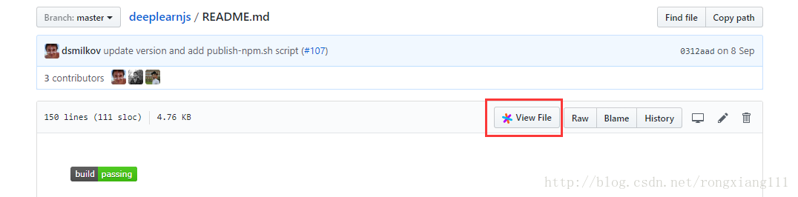
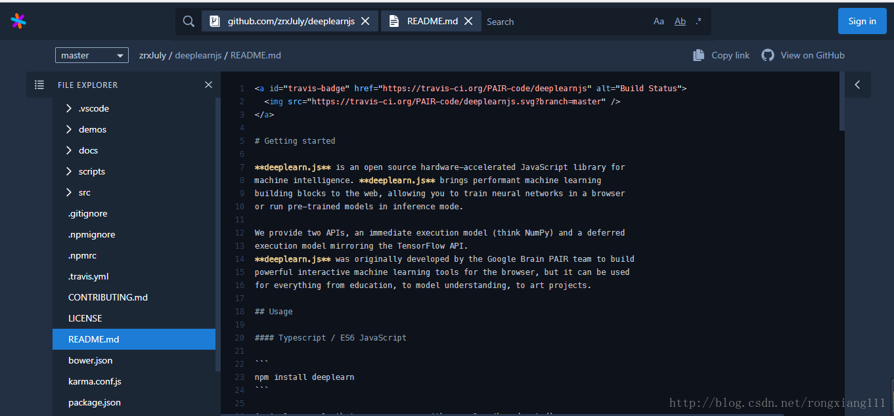

> 作为编程人员，经常会阅读大神们的代码进行学习，像GitHub上有很多好的开源的代码供我们学习，所以呢，问题就来了，一般的方法阅读代码不光费劲，而且项目结构也不容易搞清楚。偶然发现了一个可以很好地查看代码的工具Sourcegraph，觉得很好。

## Sourcegraph介绍
简单地说，Sourcegraph是一个帮助我们更好地阅读和理解代码的工具。
推荐下面文章：
[Sourcegraph:开发者的福音](http://www.linuxidc.com/Linux/2015-04/116750.htm)
<!-- more -->

## Sourcegraph插件安装
解决无法访问Chrome网上应用商店的问题：
http://www.xiazaiba.com/jiaocheng/2453.html
1.在chrome网上应用商店中搜索：sourcegraph
2.找到Sourcegraph for GitHub，点击添加至CHROME。
## 在GitHub上利用Sourcegraph查看阅读代码
进入GitHub，找一个项目，点开一个文件，在工具栏里会看到多了一个View File的按钮，点击此按钮，如下图：

进入如下页面：

这样我们就可利用Sourcegraph很方便地查看代码了，是不是很方便，而且项目结构也非常清晰^.^。