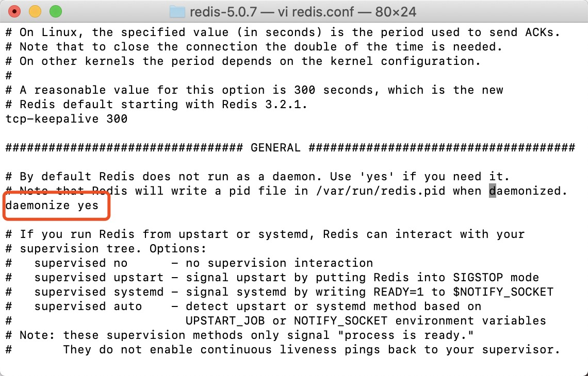
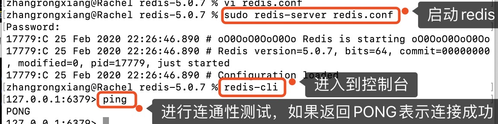

## Redis介绍
- Redis是一个开源、高级的键值存储和一个适用的解决方案，用于构建高性能、可扩展的web应用程序，遵循BSD协议<a href="#to-bsd">[1]</a>，是一个高性能的key-value数据库。
- Redis特点：
  * 支持数据持久化。可将内存中的数据保存在磁盘中，重启时可再次加载使用。
  * 数据结构存储类型丰富，eg：list,set,zset,hash,string等。
  * 支持master-slave模式的数据备份。
<!-- more -->  

## Redis优点
- 性能高，读写速度快。
- 数据类型丰富。支持大多数数据类型的操作，如列表、集合、排序集、散列。
- 操作具有原子性。要么成功执行，要么失败都不执行。单个操作是原子性的，多个操作也支持事务原子性。  

## Redis与同类产品作为高速缓存比较
除了Redis，同样可以作为缓存的有Ehcache、Memcached。
- Ehcache：Java开源项目，引入jar包即可方便的使用。
- Memcached：如果开启多线程模式，读取速度将会有很大提高。数据只会存储于内存中，挂掉后不可恢复。
- Redis：数据结构丰富；支持主从、分片等多种高级特性，用于负载均衡和容灾，具有高可用性。

## Redis安装（Mac版）
### 从[官网](https://redis.io/download)下载稳定版本（Stable）的安装包
### 将解压包解压到你的指定目录下（我一般将安装包放到`/usr/local/tools/`下），然后进入到redis解压目录下
### 编译测试：`sudo make test`
测试报错：`[exception]: Executing test client: couldn't execute "src/redis-benchmark": no such file or director`
`make[1]: *** [test] Error 1`
`make: *** [test] Error 2`
报错不影响安装，可以继续往下执行。
（报错问题暂时未解决。
试过
`make distclean`  
`make` 
`make test`
无效）
### 编译安装：`sudo make install`
### 修改redis.conf中的daemonize，让服务在后台启动.
输入`sudo vi redis.conf`进入vi编辑；
输入`/daemonize` 回车，查找daemonize所在位置；
修改redis.conf中的daemonize no改成yes；（输入i编辑，编辑完后按esc退出编辑，输入`:wq`保存编辑并退出。

### 启动Redis ，测试
`sudo redis-server redis.conf`：启动redis；
`redis-cli`：进入控制台；
`ping`：进行连通性测试。

### 关闭
输入`shutdown`关闭redis实例。
输入`exit`退出控制台。

OK，到此Redis安装就结束啦，有问题可以留言一起讨论哦～

## 参考资料
[http://www.runoob.com/redis/redis-install.html](http://www.runoob.com/redis/redis-install.html)
[https://www.yiibai.com/redis/redis_quick_guide.html](https://www.yiibai.com/redis/redis_quick_guide.html)
[https://www.cnblogs.com/yiwangzhibujian/p/7053840.html](https://www.cnblogs.com/yiwangzhibujian/p/7053840.html)
## 标注
- [1] BSD开源协议：使用者可自由使用、修改源代码，也可将修改后的代码作为开源或者专有软件再发布。BSD鼓励代码共享，但要尊重代码作者的著作权。

