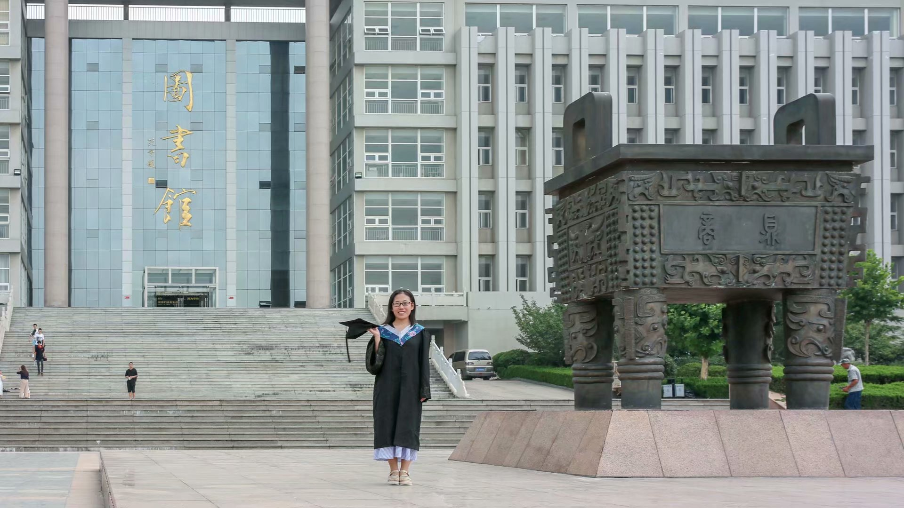

> 人生的道路虽然漫长，但紧要之处往往只有几步，特别是当人年轻的时候。没有一个人的生活道路是笔直的、没有岔道的。有些岔道口，譬如政治上的岔道口，事业上的岔道口，个人生活上的岔道口，你走错一步，可以影响人生的一个时期，也可以影响一生。————柳青

&emsp;&emsp;读路遥的《人生》，序言中引用的柳青的这段话让我很受感触，摘抄下来。人生真的是很奇妙，对吧？有时当我身旁寂静无人的时候，心底总是会不由自主地思考一些关于自己的源和终的问题，我是谁？我在哪儿？我在干什么？我的未来会是什么样子？未来的我会有大作为吗？谁将与我共度余生？我老了会是什么样子？死后呢？我死后还会有思想吗？人的思想应是出生时就被赋予，有没有想过，死后，当然肉体是归于尘土，但你的思想呢？精神呢？是否也随肉体长埋地下？一系列的问题又将自己带入了迷茫的状态。未来的一切，都是那么扑朔迷离，吊人胃口，让人期待。每次这样问自己的时候，不知道哪里的强大的力量，总是会告诉自己，我的人生注定是不平凡的，总觉得自己肯定会做出一些“惊天动地”的事情。
&emsp;&emsp;然而，事实上，现在的我并没有什么大作为，没有做一些对社会有突出贡献、惊天动地之事让众人知道自己，记住自己的名字，也并没有实现自己的人生价值，虽然自己也不知道怎样才算是实现了自己的人生价值。我现在21岁，其实这个年纪算是我人生的一个转折点，我知道在我21岁这个人生岔道口上，我走的每一步，做出的每一个选择，都会对我以后的人生产生很大影响。
<!-- more -->
&emsp;&emsp;想起了去年年底学期末，一七年的10-11月份，那时还在校，自己一直纠结考研还是工作的问题。考研，也忘记了是什么时候开始有的这个打算，应该是刚入学的时候，因为自己的不甘心，先是报了自考班，之后在课上老师也鼓励我们考研，所以这个想法在心中扎根，一直到现在。当时加了好多考研群，也面临选专业、选学校。专业不用纠结，软件工程，是自己喜欢的。学校的话当时也不知道怎么选择，各方面优劣，当时都想把研招网上的一些学校的报录比等信息爬出来，不过并没有，当时应该是忙着考试，也搁置了，之后也很快定好了学校。前期工作准备好了，自己又纠结，如果我选择考研，那么我将近一年不会工作，肯定也不可能住在家里，考虑到租金、日常生活等资金方面，是很大的问题。再有，努力了一年，考上了还好，但是如果得不到我想要的结果怎么办？那么我还得面临找工作，一年，技术更新的太快了，那个时候我都不知道落后到哪里去了，想想也害怕。工作，可以赚钱，可以学到新技术，可以认识新同事，更能够锻炼自己，但是，梦想就此搁置，不甘心啊。也许你会说可以边工作边考研啊，但是怕自己没有那么多精力，赔了夫人又折兵。想了很久，其实心中也早已有了答案，但是还是左右摇摆不定。咨询老师，帮我分析，一方面，现在复习，战线会拉的太长，到最后关头或许就厌了；另一方面，实习能够学到很多东西，怕我失去这次锻炼自己的机会，先等工作稳定，说不定两方面都能兼顾了呢？嗯，心中的答案更加坚定了，工作吧。
&emsp;&emsp;年底开始找工作，写简历，投简历，回应的却很少，打电话邀请面试的却是很多的，不过全部都是培训公司，自己当时却是没经验，分不清，傻傻的面试了几家，不过长经验了。同学也是，好多都是培训公司打来的电话，在这里就想吐槽一下，培训公司借着招人的名义，约面试，最后让你培训，真的是很不靠谱了。就这样，年前就面试了几家培训公司，放弃找工作，回家，开开心心的过最后一个寒假。年后初六离家去找工作，在这里感谢我找工作期间收留我的好姐妹。第六天收到第一个面试邀请，第九天正式上班。第一次找工作还算顺利，对口，待遇不错，老板同事也都很好，入职后，每天都很充实，对未来充满期待，但到第三个月，安排了自己并不太喜欢的工作，与自己之前面试时候的工作不同，而且一干就是三四个月，开始着与自己职业规划不符的工作，心里落差挺大的，对当时的工作，甚至对当时的自己越来越厌恶，终于，七月下旬的时候，我提出了离职，没有一丝犹豫。离职的原因无非就三点：1.不喜欢当时的工作；2.不喜欢当时烦躁无味的生活；3.想要去追求自己的梦想，不想自己的人生就这样度过了。像《谁动了我的奶酪》中的唧唧一样，感受到变化后，应该正确的对自己的变化做出正确的应对，所以，我做出了人生中一个重要的且正确的决定。
&emsp;&emsp;做完交接工作后，9月上旬才正式离职，其实那一个多月的时间也是够痛苦的，这期间也对一些人从最初的崇拜到无感再到失望，最后到绝望。前段时间看到过一篇文章，大体是说离职的时候可以检验人品，嗯，有点道理。总之一句话，离职挺难的。工作那半年自己尽自己最大努力工作，也无憾了。
&emsp;&emsp;下面才进入正题，前面算是对自己上半年的一个总结吧。9月中旬，开始自己的新生活，一切都是未知的，只有自己清晰的目标和方向。投简历，重新找工作。然而，这次找工作并没有那么顺利，前后二十多天才把工作定下来，不过，只要是自己喜欢的，晚一点也没有关系。现在工作了已有一周时间，有压力，就会有动力，很充实，未来可期，要一直一直好好努力！
就先写这么多了吧。
