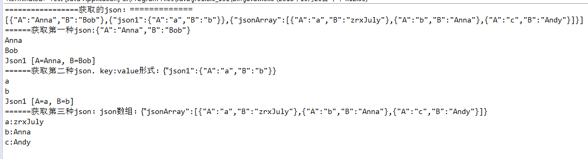

 

### 前端使用Ajax传值到后端
代码示例如下：
```js
var postData = [];
var json1 = {"a":"a","b":"b"};
var jsonArray = [{"id":"a","name":"zrxJuly"},{"id":"b","name":"Anna"},{"id":"c","name":"Andy"}];
postData.push({"json1":json1});
postData.push({"jsonArray":jsonArray});
$.ajax({
    type : "post",
    url : "/test",
    data : {testData:JSON.stringify(postData)},
    dataType : "json",
    success : function(data) {
        console.log('成功后的回调函数');
    },
    error : function() {
        console.log('失败后的回调函数');
    }
});
```
### 后端接收前端传来的数据
> 后端SpringBoot接收前端数据及处理,使用Gson解析json.  

```java
@PostMapping(value = "/test", produces = { MediaType.APPLICATION_JSON_UTF8_VALUE })
public void test(String testData) throws Exception {
    // JSON数据格式：
    // [{"A":"Anna","B":"Bob"},{"json1":{"A":"a","B":"b"}},{"jsonArray":[{"A":"a","B":"zrxJuly"},{"A":"b","B":"Anna"},{"A":"c","B":"Andy"}]}]
    
    //String testData = "[{\"A\":\"Anna\",\"B\":\"Bob\"},{\"json1\":{\"A\":\"a\",\"B\":\"b\"}},{\"jsonArray\":[{\"A\":\"a\",\"B\":\"zrxJuly\"},{\"A\":\"b\",\"B\":\"Anna\"},{\"A\":\"c\",\"B\":\"Andy\"}]}]";
    System.out.println("=================获取的json：=============");
    System.out.println(testData);
    // 1.将该json数组字符串转化为json数组对象.
    JSONArray dataJson = JSONArray.fromObject(testData);
    // 获取数组元素,数组内元素都是json.
    // 获取第一种json.
    System.out.println("======获取第一种json:"+dataJson.get(0));
    // 映射为对象.
    Json1 json1 = new Gson().fromJson(dataJson.get(0).toString(), Json1.class);
    System.out.println(json1.getA());
    System.out.println(json1.getB());
    System.out.println(json1.toString());
    // 获取第二种json. key:value形式.
    System.out.println("======获取第二种json. key:value形式："+dataJson.get(1));
    // 将获取的值解析为Json对象.
    JsonObject jsonObject2 = (JsonObject) new JsonParser().parse(dataJson.get(1).toString());
    // 映射为对象.
    Json1 json11 = new Gson().fromJson(jsonObject2.get("json1"), Json1.class);
    System.out.println(json11.getA());
    System.out.println(json11.getB());
    System.out.println(json11.toString());
    // 获取第三种json：json数组
    System.out.println("======获取第三种json：json数组："+dataJson.get(2));
    JsonObject jsonObject3 = (JsonObject) new JsonParser().parse(dataJson.get(2).toString());
    List<Json1> json1List = new Gson().fromJson(jsonObject3.get("jsonArray"), new TypeToken<List<Json1>>() {}.getType());
    for (int i = 0; i < json1List.size(); i ++) {
        System.out.println(json1List.get(i).getA()+":"+json1List.get(i).getB());
    }
}
```
<!-- more -->
在解析json取值前，我们需要将json对象映射为我们实体类中的对象,需要建立json的映射Bean.
```java
/**
 * @author zrxJuly
 * @Description json的映射Bean.
 */
public class Json1 {
    private String A;
    private String B;
    public String getA() {
        return A;
    }
    public void setA(String a) {
        A = a;
    }
    public String getB() {
        return B;
    }
    public void setB(String b) {
        B = b;
    }
    @Override
    public String toString() {
        return "Json1 [A=" + A + ", B=" + B + "]";
    }
    
}
```
输出结果如下：
 