 

> 摘要

- 环境安装工具准备
- JDK安装
- tomcat安装
- MySQL安装

## 一、环境安装工具准备
> Linux系统：centos7

### 安装工具
1. JDK8安装包：jdk-8u131-linux-x64.rpm
2. Tomcat8.5安装包：apache-tomcat-8.5.41.tar.gz
3. MySQL5.6安装包：mysql-5.6.45-linux-glibc2.12-x86_64.tar.gz

### 工具下载
可从官网下载。
已把安装工具存于百度网盘：
&emsp;&emsp;链接：https://pan.baidu.com/s/1ts1vRhtzKeMmP9VlnDi4gg 
&emsp;&emsp;提取码：2nom 

### 工具上传
如何将安装包上传到Linux服务器上？
两个工具：WinSCP和SecureCRT（of course,其他的也可以滴)

<!-- more -->

## 二、JDK安装
### -JDK安装包存放位置
&emsp;&emsp;建议将安装包存放到 `/usr/local/` 目录下。[不要放在 `/home` 路径下，容易涉及到不同用户的访问权限]。
&emsp;&emsp;我的存放到了 `/usr/local/tools/` 下，安装工具都放到了这里。
### -执行安装命令
进入到 `/usr/local/tools/` 下，执行：
```
rpm -ivh jdk-8u131-linux-x64.rpm
```
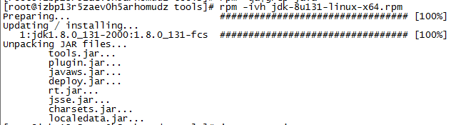 

### -检查是否安装成功
&emsp;&emsp;安装完成后，输入 `java -version` 检查是否安装成功。出现java的版本信息，即安装成功：
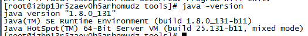 

### -配置环境变量
#### 查看JDK安装路径
配置环境变量前，我们需要知道JDK的安装路径。
如下图，依次按照红框内命令执行：
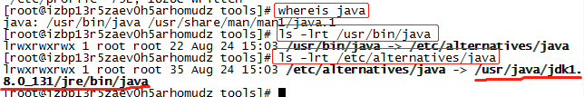 

图上最后划红线的即安装路径。
#### 配置环境变量
编辑 `/etc/profile`文件：
```
vim /etc/profile
```
[输入i，进行编辑]
复制如下内容，粘贴到文件末尾：
```
export JAVA_HOME=/usr/java/jdk1.8.0_131/
export PATH=$JAVA_HOME/bin:$PATH
export CLASSPATH=.:$JAVA_HOME/lib/dt.jar:$JAVA_HOME/lib/tools.jar
```
[Esc退出编辑，:wq 保存退出]。
#### 重新加载环境变量使配置生效
输入：
```
source /etc/profile
```

## 三、tomcat安装
### -解压Tomcat安装包
进入到 `/usr/local/tools/` 下，执行命令解压Tomcat安装包：
```
tar -zxvf apache-tomcat-8.5.41.tar.gz
```
### -移动并重新命名文件夹（非必须步骤）
我这里将解压后的Tomcat移动到了 `/usr/local` 下，并重新命名文件夹：
```
mv apache-tomcat-8.5.41 /usr/local/tomcat8-80
```
### -修改Tomcat端口号（非必须步骤）
进入conf，编辑server.xml文件，可修改端口号.
### -Tomcat内多余文件(夹)的删除（非必须步骤）
在webapps下，除了ROOT及其目录下的文件(测试启动是否成功，访问用)，其他都可删除，可删除目录如下红框内：
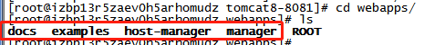
### -启动Tomcat
到bin目录下，输入`./startup.sh` ，启动Tomcat，浏览器输入 `ip:端口号` 访问（确保服务器已开启端口访问权限），若成功访问，则配置成功。

### - 一个Linux服务器内启动多个Tomcat
**多个Tomcat安装在同一台操作系统上，需修改Tomcat的配置文件server.xml的三个端口**
**1. 8005端口**
```xml
<Server port="8005" shutdown="SHUTDOWN">
```
- 作用：关闭Tomcat通信接口。该端口负责监听关闭Tomcat的请求。
这里我改成了8006
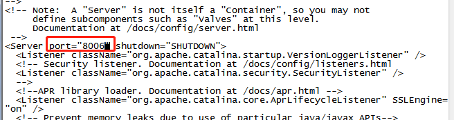

**2. 8080端口** 
```xml
<Connector connectionTimeout="20000" port="8080" protocol="HTTP/1.1" redirectPort="8443"/>
```
- 作用：建立http连接，例如浏览器访问。
这里我改成了8081
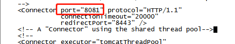

**3. 8009端口** 
```xml
<Connector port="8009" protocol="AJP/1.3" redirectPort="8443"/>
```
- 作用：与其他http服务器通信接口，用于http服务器集合
这里我改成了8010
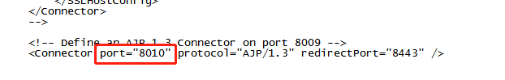

以上三个端口，各个Tomcat只要不冲突即可。
## 四、MySQL安装
### - 检查是否安装过mysql
查询：
```
rpm -qa|grep -i mysql
```
删除遗留MySQL：
```
rpm -e 文件名 --nodeps
```
### - 解压
进入MySQL安装包所在目录，执行解压命令：
```
tar -zxvf mysql-5.6.45-linux-glibc2.12-x86_64.tar.gz 
```
### - 重命名
将解压后的MySQL（移动）重命名为mysql，`/usr/local/`下：
```
mv mysql-5.6.45-linux-glibc2.12-x86_64 /usr/local/mysql
```

### - 添加用户组和用户
命令`groups mysql`查看用户组，若已添加，会提示已存在，可不用再重复添加。
#### 添加用户组：
```
groupadd mysql
```
#### 添加用户：
```
useradd -r -g mysql mysql
```

### - 修改配置文件
进入到`/usr/local/mysql`目录下：
- **复制配置文件**
```
cp support-files/my-default.cnf /etc/my.cnf
```
- **配置my.cnf**
```
vim /etc/my.cnf
```
文件末尾添加以下配置信息(也可将原文件内容清空，把以下内容复制，注意basedir和datadir要替换成自己mysql的目录位置)：
```
[mysql] 
default-character-set=utf8
[mysqld] 
#skip-grant-tables
skip-name-resolve 
port = 3306 
# 解压后的mysql的位置
basedir=/usr/local/mysql
datadir=/usr/local/mysql/data 
max_connections=200 
character-set-server=utf8 
default-storage-engine=INNODB
lower_case_table_names=1
max_allowed_packet=16M
```

### - 安装
进入到`/usr/local/mysql`目录下，执行安装命令：
```
./scripts/mysql_install_db --user=mysql --basedir=/usr/local/mysql/
```
若执行命令时出现如下报错信息(一般是相应库没有安装，我安装时遇到以下两个错误，从网上查一下解决办法，安装相应库即可)：
1. `please install the following Perl modules before executing ./scripts/mysql_install_db:`
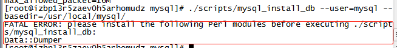
解决方法：安装autoconf库：
```
yum -y install autoconf
```
2. `...error while loading shared libraries: libaio.so.1...`
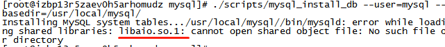
解决方法：安装libaio库：
```
yum -y install libaio*
```

### - 修改目录权限
进入到mysql下
修改当前目录拥有者为root用户：
```
chown -R root:root ./
```
修改data目录拥有者为mysql用户：
```
chown -R mysql:mysql data
```
### - 启动
#### 启动方法一
```
service mysqld start
```
若启动时，出现如下错误：
`Failed to start mysqld.service: Unit not found.`
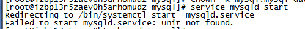
- **问题原因：**

&emsp;&emsp;由于/etc/init.d/ 不存在mysqld命令。但是有的安装完成后存在，是因为安装包中有相应的命令将mysql.server文件copy到/etc/init.d/下面了。
- **解决方法1：**

进入到mysql目录下，执行如下命令：
```
cp ./support-files/mysql.server /etc/init.d/mysqld
```
再执行以下任何命令，都可成功：
```
service mysqld status    # 查看mysql当前启动状态
service mysqld stop      # 停止mysql服务
service mysqld start     # 启动mysql服务
service mysqld restart   # 重启mysql服务
```
- **解决方法2**

【网上的另一种解决方法】
第1步 安装mariadb-server
```
yum install -y mariadb-server
```
第2步 启动服务
```
systemctl start mariadb.service
```
第3步 添加到开启启动
```
systemctl enable mariadb.service
```
> 以前版本的CentOS都是使用MySQL作为数据库的，而从CentOS 7开始启用了MariaDB。
相关参考：[CentOS 7为什么放弃了MySQL，而改使用MariaDB？](https://www.zhihu.com/question/41832866)

#### 启动方法二
该启动方法，不存在方法一的问题，mysql目录下执行命令：
```
./support-files/mysql.server start
```
如何关闭mysql服务？将上面的命令start改为stop即可，如下：
```
./support-files/mysql.server stop
```
### - 修改密码
#### 登录数据库
以root账号登录mysql，默认是没有密码的：
```
mysql -h127.0.0.1 -P3306 -uroot -p
```
提示输入密码的时候，直接回车即可。

但当用命令`mysql -uroot -p`登录时，报错：
- **问题描述：**
`Can't connect to local MySQL server through socket '/var/lib/mysql/mysql.sock'`
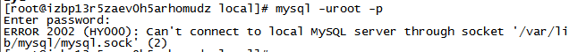
- **问题原因：**

目标文件mysql.lock找不到。mysql.sock可能会根据实际安装方式的不同，存放在不同的目录下，可能是/var/lib/mysql.sock或/tmp/mysql.sock或其他目录下，我的是在/tmp/mysql.sock下：
- **解决方法：**

创建软连接：`ln -s 源文件 目标文件`
```
ln -s /tmp/mysql.sock /var/lib/mysql/mysql.sock
```
然后重新用`mysql -uroot -p`，登录成功！
参考链接：https://blog.csdn.net/JustinQin/article/details/79209073
#### 密码修改
root账号登录后，查看mysql账号信息：
```
SELECT user,host,password FROM mysql.user;
```
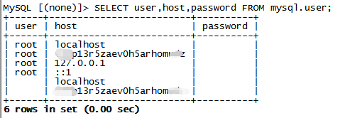
上图我们可以看到，所有账号都是没有密码的。
修改root登录密码为root：
```
update mysql.user set password=password('root') where user='root';
```
如果想设置不同host登录密码不同，可在条件上加上 `and host=''`;
```
update mysql.user set password=password('root') where user='root' and host='localhost';
```
修改完后，记得**刷新权限**：
```
flush privileges;
```

### - 设置远程主机登录
若允许root用户只能在特定ip进行远程登录，并具有所有库的操作权限，则需要指定ip：
```
GRANT ALL PRIVILEGES ON *.* TO 'root'@'特定ip' IDENTIFIED BY '你的登录密码' WITH GRANT OPTION;
```
允许root用户在任何地方进行登录，并具有所有库的操作权限：
```
GRANT ALL PRIVILEGES ON *.* TO 'root'@'%' IDENTIFIED BY '你的登录密码' WITH GRANT OPTION;
```
修改完后，记得**刷新权限**：
```
flush privileges;
```

## 总结
&emsp;&emsp;以上，Linux搭建测试环境步骤就告一段落啦~在安装MySQL的时候，遇到了很多问题，不过遇到问题就解决，并及时记录下来，还是学到了很多东西的~~
要努力学技术，毕竟技术才是硬道理！
